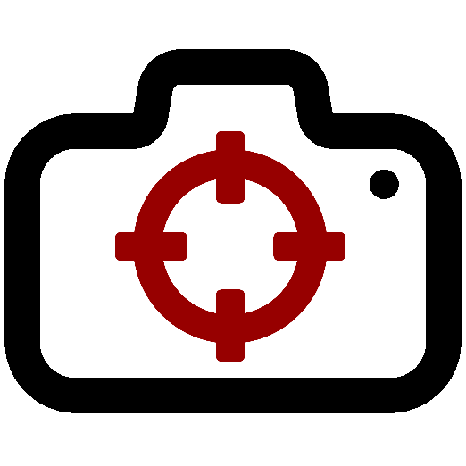

# CSGOutside
## L2A-08-bitsonebyte
  

## Project Description
CSGOutside is a real life tactical shooter game based off the game CSGO. Players play this game using their phones 
How it works 
-Players are divided into two teams - Planters or Defusers. 
-Planters must attempt to activate the bomb while Defusers attempt to deactivate it. 
-Players on both teams try to achieve their objective while using their phones to eliminate the other team. 
Video Demo: https://www.youtube.com/watch?v=K6eeIqW7eI4

## Cloud Component Server - Srijan
Docker Container Setup 
`docker run -d -p 27018:27017 --name csgoutside-db -v csgoutside-data:/data/db mongo:latest`  
PYTHON VIRTUAL ENVIRONMENT SETUP  
`python -m venv .venv`  
`.venv/Scripts/activate` (Mac: `source .venv/bin/activate` )  
`pip install -r requirements.txt`  
The Server runs from csgoutsidedb/index.py by running `python index.py` 
NOTE: The host IP for the server app has to be the IP of the computer  

## User Component - Marc
The App runs from the testing/my-app2/ by running `npm start`  
The frontend app files are in testing/my-app2.  
NOTE: The IP adress for the sockets and POST/GET requests has to be same as that of server  

## Cloud Component ML Model - Sarthak
The ML Model is in CSGO_FINAL and can be deployed by running `python webapp.py`  
Note: All directory names must be changed as they point to the local dev computer. Also, model weights can be supplied on request if required (since its a huge folder and is unfeasible to push) 

## Hardware Component - Peter
Hardware component i.e. De1-Soc and the rest of the physical components was done by Peter 
To run: Load sof in quarutus.  
Set up lua: via the explorer and set ip address 
Load code: through nios explorer 
